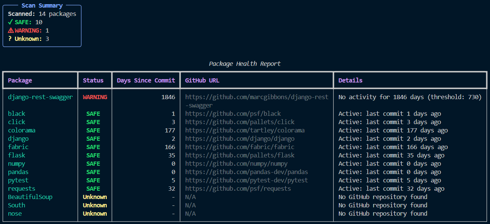

# Zombie Package Detector

<div align="center">
  
  [](https://www.python.org/downloads/)
  [](https://github.com/psf/black)
  [](LICENSE)


</div>

---


**A production-quality Python CLI tool that identifies unmaintained dependencies by analyzing their GitHub repository activity.**

In modern software supply chains a package without known CVEs isn't necessarily safe. If a library hasn't been updated in years, no one is there to patch future vulnerabilities. **Zombie Package Detector** helps you identify these "living dead" dependencies before they become a risk.

---

## ✨Features

* **Accurate Parsing:** Handles complex `requirements.txt` files using the `packaging` library.
* **Smart GitHub Detection:** Automatically resolves GitHub URLs from PyPI metadata (filtering out documentation or unrelated links).
* **Smart Caching (TTL):** JSON-based cache that automatically refreshes data older than **24 hours**. This ensures freshness while minimizing API calls.
* **Health Classification:**
    * 🟢 **SAFE:** Actively maintained (commits within 2 years).
    * ⚠️ **WARNING:** Stale/Inactive (Potential Zombie - no activity for 730+ days).
    * ⚪ **UNKNOWN:** Could not verify (Safe fallback).
* **Rich Terminal UI:** Powered by `rich`, featuring colored tables and progress bars.
* **Robust:** Gracefully handles API rate limits and network issues.

---

## 🛠️Installation

### 1. Clone the repository

```
git clone [https://github.com/0xQenawy/zombie-package-detector.git](https://github.com/0xQenawy/zombie-package-detector.git)
cd zombie-package-detector
```

### 2. Set up a Virtual Environment
```
python -m venv venv
source venv/bin/activate  # On Windows: venv\Scripts\activate
```
### 3. Install the tool
#### For users:
```
pip install -r requirements.txt
```
#### For development:
```
pip install -e .
```
## ⚙️Configuration

#### GitHub Token (Highly Recommended)
#### GitHub allows 60 unauthenticated requests/hour. To scan larger projects (up to 5,000 requests/hour), use a Personal Access Token.

#### 1. Go to GitHub Developer Settings > Personal access tokens.

#### 2. Generate a Classic Token.

#### 3. Select scope: public_repo (optional, usually no scopes needed for public info).

#### 4. Set it in your terminal:
```bash
export GITHUB_TOKEN=ghp_your_token_here
```
##### Windows (PowerShell):
```
$env:GITHUB_TOKEN="ghp_your_token_here"
```
## 🚀Usage
### Navigate to any project directory containing a requirements.txt file and run:

```
python -m detector
```
##### To scan a specific file:

```
python -m detector path/to/my_requirements.txt
```
## 📊Example Output



## 📂Project Structure

├── detector/
│   ├── __init__.py          # Package initialization
│   ├── __main__.py          # CLI entry point
│   ├── config.py            # Configuration & Constants
│   ├── parser.py            # requirements.txt parsing logic
│   ├── pypi_client.py       # PyPI metadata fetcher
│   ├── github_client.py     # GitHub API client + Smart Caching
│   ├── health_checker.py    # Health evaluation logic (The Brain)
│   └── report.py            # Rich UI rendering
├── .gitignore               # Git ignore rules
├── requirements.txt         # Tool dependencies
└── README.md                # Documentation

## 📝Edge Cases Handled
### The tool is designed to handle various edge cases robustly:

#### Invalid or malformed requirement lines
#### Multiple GitHub URLs in PyPI metadata (prioritizes "Source", "Code", "Repository")
#### Documentation and issue tracker URLs (filtered out)
#### Network timeouts and connection errors
#### GitHub API rate limiting
#### Repositories that return 404 (marked as UNKNOWN)
#### Persistent caching to reduce API calls across runs

## 🛠Development

#### Install development dependencies
```
pip install black ruff pytest
```
#### Format code
```
black detector/
```
#### Lint code
```
ruff check detector/
```
#### Run tests
```
pytest
```

## 📄 License
This project is licensed under the MIT License.
##
> **Note:** AI tools (LLMs) were used to accelerate boilerplate coding and implementation, allowing the author to focus on architecture, security logic, and user experience.
